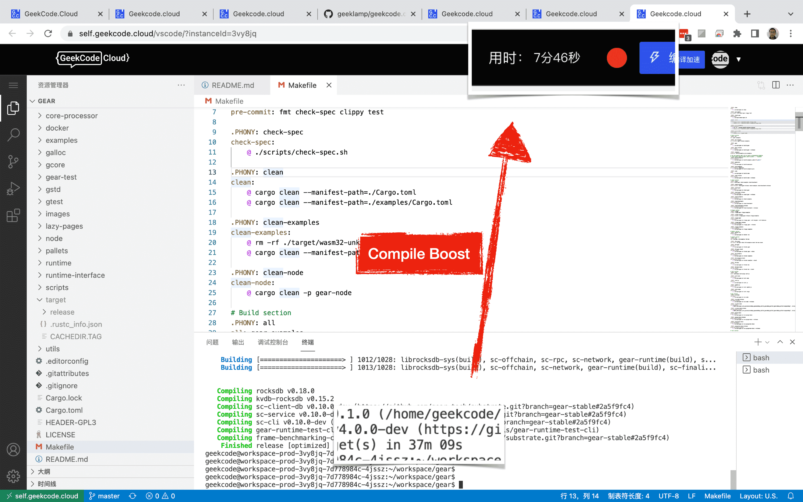

# What is GeekCode.Cloud?

English | [简体中文](./README-CN.md)

## 0. What is Cloud IDE
Cloud IDEs are integrated development environments based in the cloud. IDEs let you write run and debug your code. Typicaly developers set up IDEs on their local machine, but Cloud-based IDEs allow you to develop software with just a browser.

## 1. GeekCode.Cloud Features

### Compile Boost

When compiling the code, the host configuration is hot updated, and the number of CPUs and memory size are increased to improve the compilation speed.

### Dev URL

Through virtual domain name and port forwarding, Dev URL is created, and the internal API of the cloud environment is exposed to the outside through the gateway. Improve development efficiency.

### Development Template

Process configuration, define cloud development templates, and quickly build a development environment.

### Development Environment Management

Standardized development environment. Create, share, copy management.

## 2. GeekCode.Cloud Scenarios

### Remote Integrate Test

For remote integration testing, the tedious steps of intermediate code push, packaging, mirroring, and deployment to the test machine are omitted, and the Dev URL of the development environment is directly shared with your partners for joint debugging.

### Web3 / Rust compile

The new scenarios and languages ​​solve the problem of slow Rust compilation speed through compilation acceleration technology, and improve the development efficiency of basic software engineers, Web3 engineers and Rust language engineers.

### Quick Demo /POC

Quick product demonstration and promotion, giving customers a convenient demonstration environment, which can be used immediately and reduce communication costs.

### Teamwork

The R&D team works together, sharing workspace, Code Review, Quick Test, Walk-through, team management and code security, and solves problems through Cloud IDE and platform

## 3. FAQ

* [How to use *Compile Boost*](https://github.com/geeklamp/geekcode.cloud/wiki/How-to-use-Compile-Boost)
* [How to use *Dev URL*](https://github.com/geeklamp/geekcode.cloud/wiki/How-to-use-Dev-URL)

## 4. Community
- GitHub Discussions: click [link](https://github.com/geeklamp/geekcode.cloud/discussions)
 to join
- Lark/Feishu Group: click [link](https://applink.feishu.cn/client/chat/chatter/add_by_link?link_token=381ma10a-4d3f-473c-acd4-ff238c12153a) to join
- Telegram Group: click [link](https://t.me/GeekCodeCloud) to join